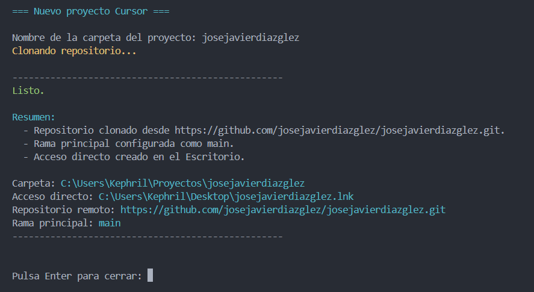

# Setup

**Idioma / Language:** [Español](#español) · [English](#english)

<details id="español">
<summary><strong>Español</strong> - haz clic para expandir</summary>

## Acceso directo Cursor / VS Code

Utilidad para Windows que automatiza la puesta en marcha de proyectos en [Cursor](https://cursor.com/) o [VS Code](https://code.visualstudio.com/).

A partir del nombre de un repositorio, clona el código desde GitHub, configura la rama `main` y genera un acceso directo en el Escritorio para abrir el workspace en una ventana nueva del editor elegido.

## Características

- Clonado de repositorios por nombre: `https://github.com/<githubUser>/<nombre>.git`
- Configuración centralizada en un único archivo JSON versionado
- Acceso directo (`.lnk`) con icono personalizado apuntando a Cursor o VS Code
- Reutilización de carpetas existentes: actualiza remoto y acceso directo sin sobrescribir datos
- Salida estructurada en consola con resumen de rutas y estado

## Requisitos previos

| Requisito | Detalle |
|-----------|---------|
| Sistema operativo | Windows 10 o superior |
| PowerShell | Versión 5.1 o superior |
| Git | [Git for Windows](https://git-scm.com/download/win) |
| Editor | Cursor y/o VS Code instalados en la ruta estándar de usuario |
| Node.js | Opcional; habilita `npm run start:*` y `npm run ejecutable:*` |

## Configuración

El archivo [`config/config.json`](config/config.json) es **público** en el repositorio. Tras clonar o hacer fork, edítalo antes de ejecutar el script.

```json
{
  "githubUser": "javierdiazglez",
  "projectsFolder": "Proyectos",
  "shortcutsFolder": "Desktop"
}
```

| Campo | Descripción | Valor de ejemplo |
|-------|-------------|------------------|
| `githubUser` | Usuario de GitHub. El script clona `https://github.com/<githubUser>/<nombre>.git` | `javierdiazglez` |
| `projectsFolder` | Carpeta relativa bajo `%USERPROFILE%` donde se crean los proyectos | `Proyectos` |
| `shortcutsFolder` | Destino de los accesos directos. Usa `Desktop` o una ruta absoluta | `Desktop` |

Los tres campos son obligatorios. Si alguno falta o está vacío, el script termina con un error descriptivo.

## Uso

### Opción A - Acceso directo del lanzador

**Cuándo usarla:** para ejecutar el script con doble clic desde el Escritorio o la carpeta del proyecto.

```bash
npm run ejecutable:cursor
npm run ejecutable:vscode
```

**Resultado:** genera o actualiza `nuevo-proyecto-cursor.lnk` o `nuevo-proyecto-vscode.lnk` en la raíz del proyecto. Vuelve a ejecutar el comando cada vez que modifiques el script `.ps1` correspondiente.

Los accesos directos invocan:

```
powershell.exe -NoProfile -ExecutionPolicy Bypass -File "...\scripts\nuevo-proyecto-cursor.ps1"
powershell.exe -NoProfile -ExecutionPolicy Bypass -File "...\scripts\nuevo-proyecto-vscode.ps1"
```

### Opción B - npm

**Cuándo usarla:** forma recomendada si tienes Node.js instalado.

```bash
npm run start:cursor
npm run start:vscode
```

**Resultado:** ejecuta el script principal de forma interactiva.

### Opción C - PowerShell directo

**Cuándo usarla:** sin dependencias de Node.js.

```powershell
powershell.exe -NoProfile -ExecutionPolicy Bypass -File .\scripts\nuevo-proyecto-cursor.ps1
powershell.exe -NoProfile -ExecutionPolicy Bypass -File .\scripts\nuevo-proyecto-vscode.ps1
```

**Resultado:** mismo comportamiento que la opción A.

## Salida esperada

Al introducir el nombre del proyecto (por ejemplo, `javierdiazglez`), la consola muestra un resumen como el siguiente:



## Comportamiento

- **Carpeta base:** `%USERPROFILE%\<projectsFolder>` (se crea automáticamente si no existe).
- **Acceso directo:** se genera en la ruta definida por `shortcutsFolder`.
- **Repositorio remoto:** `https://github.com/<githubUser>/<nombre>.git`.
- **Rama principal:** se renombra a `main` con `git branch -M main`.
- **Carpeta existente con Git:** se reutiliza, se actualiza `origin` y se regenera el acceso directo.
- **Carpeta existente sin `.git`:** el script termina con error. Elimina la carpeta o elige otro nombre.

## Estructura del proyecto

```
acceso-directo-cursor/
├── assets/
│   └── icons/
│       ├── cursor-ai-code-icon.ico
│       └── vscode-icon.ico
├── config/
│   └── config.json              # configuración pública
├── docs/
│   └── images/
│       └── salida-ejemplo.png   # captura de la salida en consola
├── scripts/
│   ├── nuevo-proyecto-cursor.ps1
│   ├── nuevo-proyecto-vscode.ps1
│   └── build-shortcut.ps1
├── nuevo-proyecto-cursor.lnk   # generado con npm run ejecutable:cursor
├── nuevo-proyecto-vscode.lnk   # generado con npm run ejecutable:vscode
├── package.json
├── SETUP.md
└── README.md
```

## Solución de problemas

| Problema | Acción |
|----------|--------|
| `No se encontro config/config.json` | Verifica que el archivo existe y contiene `githubUser`, `projectsFolder` y `shortcutsFolder` |
| `No se encontro cursor.exe` | Instala Cursor o comprueba que está en `%LOCALAPPDATA%\Programs\cursor\` |
| `No se encontro Code.exe` | Instala VS Code o comprueba que está en `%LOCALAPPDATA%\Programs\Microsoft VS Code\` |
| `No se encontro git` | Instala Git for Windows |
| Error al clonar | Comprueba que el repositorio existe en GitHub con el nombre indicado |
| Carpeta existente sin Git | Elimina la carpeta o usa otro nombre de proyecto |

</details>

<details id="english">
<summary><strong>English</strong> - click to expand</summary>

## Cursor / VS Code Shortcut

Windows utility that automates project setup in [Cursor](https://cursor.com/) or [VS Code](https://code.visualstudio.com/).

Given a repository name, it clones the code from GitHub, configures the `main` branch, and creates a Desktop shortcut to open the workspace in a new window of the chosen editor.

## Features

- Clone repositories by name: `https://github.com/<githubUser>/<nombre>.git`
- Centralized configuration in a single versioned JSON file
- Shortcut (`.lnk`) with a custom icon pointing to Cursor or VS Code
- Reuse existing folders: updates remote and shortcut without overwriting data
- Structured console output with a summary of paths and status

## Prerequisites

| Requirement | Details |
|-------------|---------|
| Operating system | Windows 10 or later |
| PowerShell | Version 5.1 or later |
| Git | [Git for Windows](https://git-scm.com/download/win) |
| Editor | Cursor and/or VS Code installed in the standard user path |
| Node.js | Optional; enables `npm run start:*` and `npm run ejecutable:*` |

## Configuration

The [`config/config.json`](config/config.json) file is **public** in the repository. After cloning or forking, edit it before running the script.

```json
{
  "githubUser": "javierdiazglez",
  "projectsFolder": "Proyectos",
  "shortcutsFolder": "Desktop"
}
```

| Field | Description | Example value |
|-------|-------------|---------------|
| `githubUser` | GitHub username. The script clones `https://github.com/<githubUser>/<nombre>.git` | `javierdiazglez` |
| `projectsFolder` | Folder relative to `%USERPROFILE%` where projects are created | `Proyectos` |
| `shortcutsFolder` | Shortcut destination. Use `Desktop` or an absolute path | `Desktop` |

All three fields are required. If any is missing or empty, the script exits with a descriptive error.

## Usage

### Option A - Launcher shortcut

**When to use:** to run the script with a double-click from the Desktop or project folder.

```bash
npm run ejecutable:cursor
npm run ejecutable:vscode
```

**Result:** generates or updates `nuevo-proyecto-cursor.lnk` or `nuevo-proyecto-vscode.lnk` in the project root. Re-run the command whenever you modify the corresponding `.ps1` script.

The shortcuts invoke:

```
powershell.exe -NoProfile -ExecutionPolicy Bypass -File "...\scripts\nuevo-proyecto-cursor.ps1"
powershell.exe -NoProfile -ExecutionPolicy Bypass -File "...\scripts\nuevo-proyecto-vscode.ps1"
```

### Option B - npm

**When to use:** recommended if you have Node.js installed.

```bash
npm run start:cursor
npm run start:vscode
```

**Result:** runs the main script interactively.

### Option C - Direct PowerShell

**When to use:** without Node.js dependencies.

```powershell
powershell.exe -NoProfile -ExecutionPolicy Bypass -File .\scripts\nuevo-proyecto-cursor.ps1
powershell.exe -NoProfile -ExecutionPolicy Bypass -File .\scripts\nuevo-proyecto-vscode.ps1
```

**Result:** same behavior as option A.

## Expected output

When you enter the project name (for example, `javierdiazglez`), the console shows a summary like the following:


## Behavior

- **Base folder:** `%USERPROFILE%\<projectsFolder>` (created automatically if it does not exist).
- **Shortcut:** created at the path defined by `shortcutsFolder`.
- **Remote repository:** `https://github.com/<githubUser>/<nombre>.git`.
- **Main branch:** renamed to `main` with `git branch -M main`.
- **Existing folder with Git:** reused, `origin` is updated and the shortcut is regenerated.
- **Existing folder without `.git`:** the script exits with an error. Delete the folder or choose another name.

## Project structure

```
acceso-directo-cursor/
├── assets/
│   └── icons/
│       ├── cursor-ai-code-icon.ico
│       └── vscode-icon.ico
├── config/
│   └── config.json              # public configuration
├── docs/
│   └── images/
│       └── salida-ejemplo.png   # console output screenshot
├── scripts/
│   ├── nuevo-proyecto-cursor.ps1
│   ├── nuevo-proyecto-vscode.ps1
│   └── build-shortcut.ps1
├── nuevo-proyecto-cursor.lnk   # generated with npm run ejecutable:cursor
├── nuevo-proyecto-vscode.lnk   # generated with npm run ejecutable:vscode
├── package.json
├── SETUP.md
└── README.md
```

## Troubleshooting

| Problem | Action |
|---------|--------|
| `No se encontro config/config.json` | Verify the file exists and contains `githubUser`, `projectsFolder`, and `shortcutsFolder` |
| `No se encontro cursor.exe` | Install Cursor or check it is in `%LOCALAPPDATA%\Programs\cursor\` |
| `No se encontro Code.exe` | Install VS Code or check it is in `%LOCALAPPDATA%\Programs\Microsoft VS Code\` |
| `No se encontro git` | Install Git for Windows |
| Clone error | Verify the repository exists on GitHub with the given name |
| Existing folder without Git | Delete the folder or use another project name |

</details>
